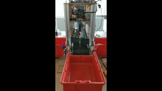
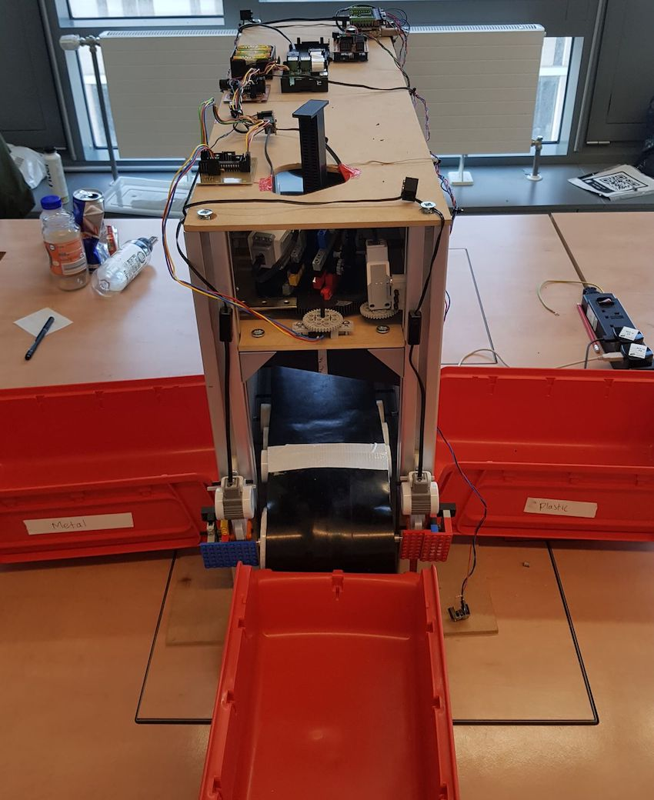
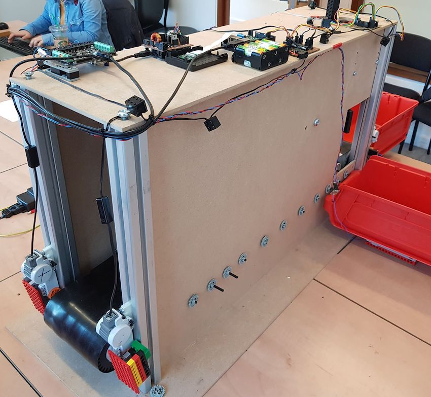

# Type Swipe

Type Swipe is a robotic system that was designed and built for UG3 System Design Project 2019, at Edinburgh University's School of Informatics. Type Swipe automatically classifies recyclable items through a combination of sensor data and computer vision as they move along a conveyor belt, then a robotic swiper arm guides the items into their appropriate bin. In particular, this system classifies glass, plastic and metallic objects, and achieved a classification accuracy of 98% on a collection of 115 glass, plastic and metal items.

